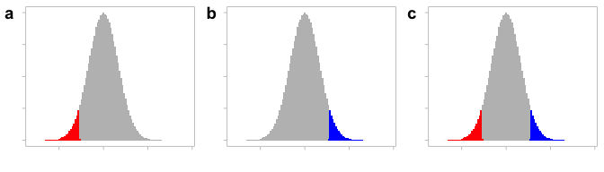

Microarray Gene Expression Analysis with R
================

# Objectives

-   Load microarray dataset into R
-   Explore the dataset with basic visualizations
-   Identify differentially expressed genes (DEGs)
-   Generate annotation of the DEGs (*Tentative*)

# The Central Dogma of Biology

# Cleft Lip and Palate

Cleft lip and cleft palate (**CLP**) are splits in the upper lip, the
roof of the mouth (palate) or both. They result when facial structures
that are developing in an unborn baby do not close completely. CLP is
one of the most common birth defects with a frequency of 1/700 live
births.

## Challgenes

Children with cleft lip with or without cleft palate face a variety of
challenges, depending on the type and severity of the cleft.

-   **Difficulty feeding.** One of the most immediate concerns after
    birth is feeding.

-   **Ear infections and hearing loss.** Babies with cleft palate are
    especially at risk of developing middle ear fluid and hearing loss.

-   **Dental problems.** If the cleft extends through the upper gum,
    tooth development may be affected.

-   **Speech difficulties.** Because the palate is used in forming
    sounds, the development of normal speech can be affected by a cleft
    palate. Speech may sound too nasal.

*Reference*: [Mayo Foundation for Medical Education and
Research](https://www.mayoclinic.org/diseases-conditions/cleft-palate/symptoms-causes/syc-20370985)

## Genetics

-   DNA variation in Interferon Regulatory Factor 6 (**IRF6**) causes
    Van der Woude syndrome (**VWS**)

-   VWS is the most common syndromic form of cleft lip and palate.

-   However, the causing variant in IRF6 has been found in *only* 70% of
    VWS families!

-   IRF6 is a **transcription factor** with a conserved helix-loop-helix
    DNA binding domain and a less well-conserved protein binding domain.

*Reference*: [Hum Mol Genet. 2014 May 15; 23(10):
2711–2720](http://doi.org/10.1093/hmg/ddt664)

## Question

Given:

1.  The pathogenic variant in IRF6 exists in only 70% of the VWS
    families

2.  IRF6 is a transcription factor

How can we identify other genes that might be involved in the remaining
30% of the VWS families?

## Hint

-   Usually, genes that are regulated by a transcription factor belong
    to the same biological process or pathway.

-   Therefore, by comparing the gene expression patterns between
    wild-type (functional) *Irf6* and knockout (non-functional) *Irf6*,
    it could be possible to identify genes that are regulated (targeted)
    by *Irf6*.

## Hypothesis

-   *H**O* : *μ**W**T* = *μ**K**O*

-   *H**A* : *μ**W**T* ≠ *μ**K**O*

-   Where *μ* is the *mean* of the gene expression values of a gene.

-   **One**-sided or **Two**-sided testing?

<!-- -->

## Why Microarray?

-   No need for candidate genes (or genes of interest)

-   One experiment assesses the entire transcriptome

-   One experiment generates many hypotheses

-   Only small amount of RNA is required (\~15–200 ng)

## Original Paper

## Experimental Design

-   3 IRF6 wild-type (+/+) and 3 knockout (-/-) mouse embryos.
-   E17.5 embryos were removed from euthanized mothers.
-   Skin was removed from embryos.
-   Total RNA was isolated from the skin.
-   Resultant RNA was hybridized to Affymetrix GeneChip Mouse Genome 430
    2.0 arrays.

## Dataset

-   The original dataset can be obtained from NCBI GEO with accession
    [GSE5800](https://www.ncbi.nlm.nih.gov/geo/query/acc.cgi?acc=GSE5800)

| ID          |     KO1 |     KO2 |     KO3 |     WT1 |     WT2 |     WT3 |
|:------------|--------:|--------:|--------:|--------:|--------:|--------:|
| 1415670\_at |  6531.0 |  5562.8 |  6822.4 |  7732.1 |  7191.2 |  7551.9 |
| 1415671\_at | 11486.3 | 10542.7 | 10641.4 | 10408.2 |  9484.5 |  7650.2 |
| 1415672\_at | 14339.2 | 13526.1 | 14444.7 | 12936.6 | 13841.7 | 13285.7 |
| 1415673\_at |  3156.8 |  2219.5 |  3264.4 |  2374.2 |  2201.8 |  2525.3 |

## Analysis

